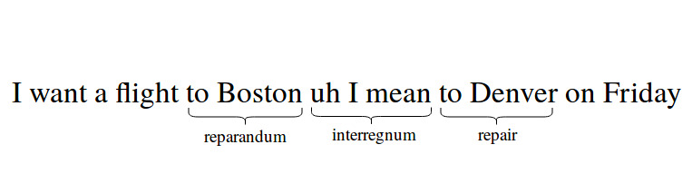
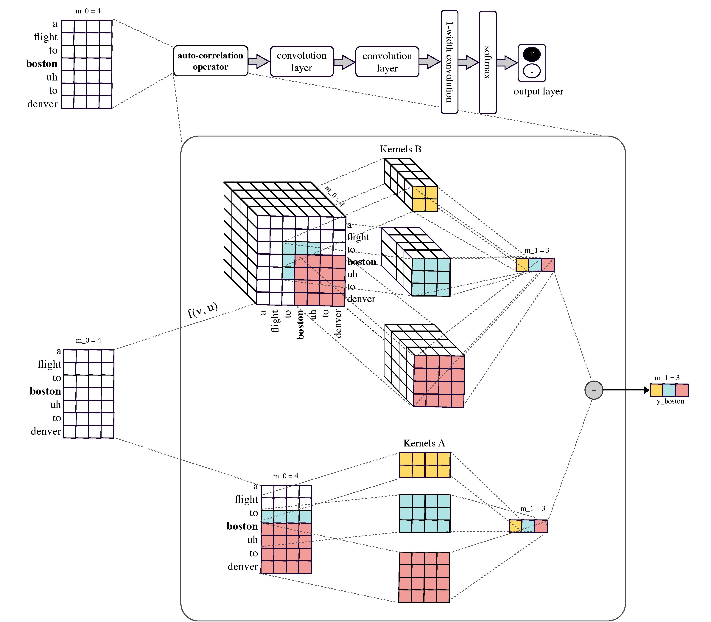

# <a href='https://www.aclweb.org/anthology/D18-1490'>Disfluency Detection using Auto-Correlational Neural Networks (ACNN)</a><br>
This is the implementation of Auto-Correlational Neural Networks (ACNN) proposed for disfluency detection from speech transcripts. 

# Task
<div align="justify">Disfluency refers to any interruptions in the normal flow of speech, including false starts, corrections, repetitions and filled pauses. The basic pattern of disfluency contains three main parts reparandum, interregnum and repair. As illustrated below, the
reparandum "to Boston" is the part of the utterance that is replaced, the interregnum "uh I mean" is an optional part of a disfluent structure, and the repair "to Denver" replaces the reparandum. The fluent version is obtained by removing reparandum and interregnum words although disfluency detection models mainly deal with identifying and removing reparanda. The repair (e.g. "to Denver") frequently seems to be a "rough copy" of the reparandum (e.g., to Boston) -- i.e. they incorporate the same or very similar words in roughly the same word order. This similarity is strong evidence of a disfluency that can help the model detect reparanda. 

<p align="center">
  
</p>

# ACNN Model
<div align="justify">CNNs and RNNs are surprisingly poor at capturing the "rough copy" dependencies; as a result, their performance heavily depends on hand-crafted pattern-match features. Auto-Correlational Neural Network (ACNN) is a novel neural network that generalises CNN and is able to learn the "rough copies" without requiring any manual feature engineering. The ACNN model only uses whole-word inputs; however, it is competitive with lots of complex models in the literature which rely on hand-crafted features, additional information sources such as partial-word features (which would not be available in a realistic ASR application), or external resources such as dependency parsers and language models. 

<p align="center">
  
</p>


# Requirements
- Python 3 
- Tensorflow > 0.12
- Numpy

```
$ git clone https://github.com/pariajm/deep-disfluency-detection
$ cd deep-disfluency-detection
```

# Data
<div align="justify">We split the Switchboard corpus into training, dev and test set as follows: training data consists of all sw[23]∗.dff files, dev training consists of all sw4[5-9]∗.dff files and test data consists of all sw4[0-1]∗.dff files. We lower-case all text and remove all partial words and punctuations from the data. The format of input and output files is one sentence per line, where each word in the input sentence has a corresponding label in the output file (labels are either "F" or "E" to denote fluent or disfluent words). Since Switchboard Corpus is not open-source, we cannot release the data split that we use to train the ACNN model. We instead provide some sample data in ./sample_data.


# Training
To train a new ACNN model from scratch:
```
$ python3 train.py --data_path=/path/to/train_and_test_files --checkpoint_dir=/dir/to/save/checkpoints_and_summaries
```

# Prediction
To use the trained ACNN model to predict disfluency labels for your own data:
```
$ cd model/checkpoints
$ wget https://github.com/pariajm/deep-disfluency-detection/releases/download/v1/model-84893.data-00000-of-00001
$ wget https://github.com/pariajm/deep-disfluency-detection/releases/download/v1/model-84893.index
$ wget https://github.com/pariajm/deep-disfluency-detection/releases/download/v1/model-84893.meta
$ cd ../..
$ python3 prediction.py --input_path=/path/to/input/file --checkpoint_dir=./model --output_path=/path/to/output/file
```

# Citation
```
@InProceedings{jamshidlou2018,
  author = 	{Jamshid Lou, Paria and Anderson, Peter and Johnson, Mark},
  title = 	{Disfluency Detection using Auto-Correlational Neural Networks},
  booktitle = 	{Proceedings of the Conference on Empirical Methods in Natural Language Processing (EMNLP2018)},
  year = 	{2018},
  pages = 	{4610--4619},
  address = 	{Brussels, Belgium},
  publisher =   {Association for Computational Linguistics},
  url       =   {https://www.aclweb.org/anthology/D18-1490.pdf}
}
```

# Credits
The baseline CNN code is a modified version of <a href='https://github.com/dennybritz/cnn-text-classification-tf'>Denny's code.</a><br>
